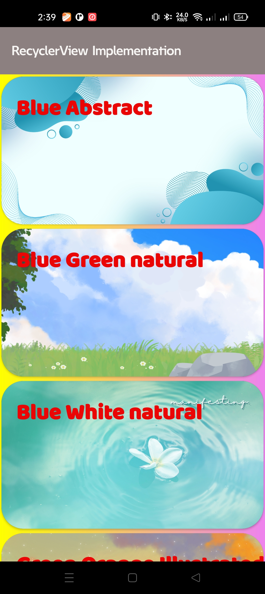
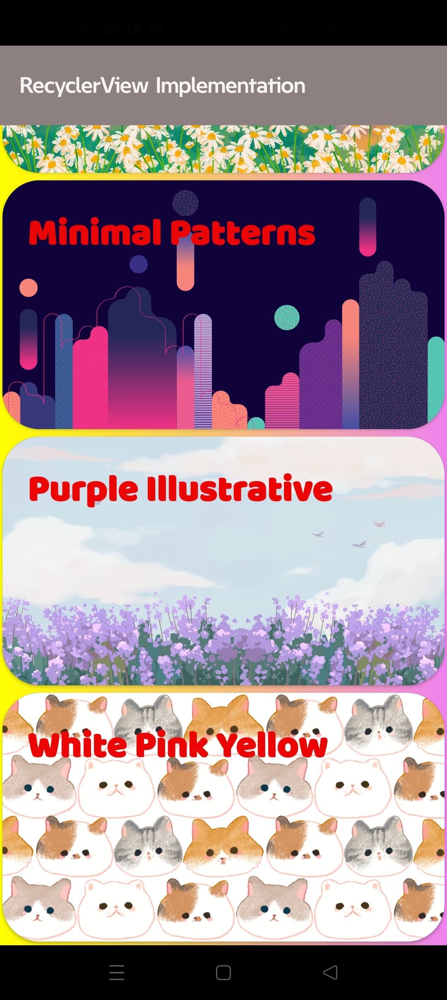

# CardView Mine

CardView Mine is an Android application primarily designed to demonstrate how to implement a `RecyclerView` to display a dynamic list of items. It also showcases the use of `CardView` UI elements to present each item in the list. The app displays a scrollable list of predefined patterns, where each pattern, consisting of a name and an image, is presented within a CardView.

## Screenshots

## Features

- Demonstrates efficient list display using `RecyclerView`.
- Displays a scrollable list of predefined patterns.
- Each pattern is shown in a Material Design `CardView`.
- Shows the name and image for each pattern.
- Simple and clean user interface.

## How to Build

1. Clone the repository: `git clone https://github.com/your-username/cardview-mine.git` (Replace with the actual repository URL if available, otherwise use a placeholder).
2. Open the project in Android Studio.
3. Let Android Studio sync the Gradle project.
4. Click on the 'Run' button (or Shift+F10) to build and run the application on an emulator or a connected Android device.

## Technologies Used

- Java
- Android SDK
- AndroidX Libraries (RecyclerView, CardView, AppCompat)
- Gradle
